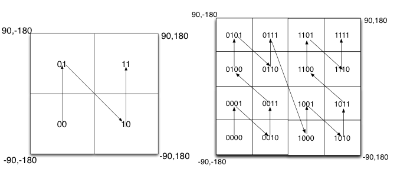
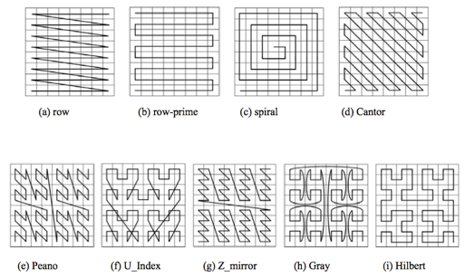

参考文章：
[GeoHash核心原理解析](https://yq.aliyun.com/articles/12?spm=a2c4e.11163080.searchblog.20.6fa42ec1zLzaC3)
[Geohash精度和原理](https://blog.csdn.net/u011497262/article/details/81210634)
[Geohash算法原理及实现](https://www.jianshu.com/p/2fd0cf12e5ba)
### 基本原理
> GeoHash就是一种编码方法。它能够将经纬度二维空间地址编码为字符串

经度范围[-180,180]，纬度范围[-90,90]

不断的进行递归对半划分，分得越多面积越小则越精确

划分后的顺序呈现Z的曲线，递归不断分解则形成了自相似的分形，这种曲线被称为Peano空间填充曲线
优点：二维转化成一维（实际是分形维），大部分编码越相似则距离越近
缺点：突变性，有些相邻但是距离很远，如-0111与1000

除Peano空间填充曲线外，还有很多空间填充曲线，如图所示，其中效果公认较好是Hilbert空间填充曲线，相较于Peano曲线而言，Hilbert曲线没有较大的突变。为什么GeoHash不选择Hilbert空间填充曲线呢？可能是Peano曲线思路以及计算上比较简单吧，事实上，Peano曲线就是一种四叉树线性编码方式。
