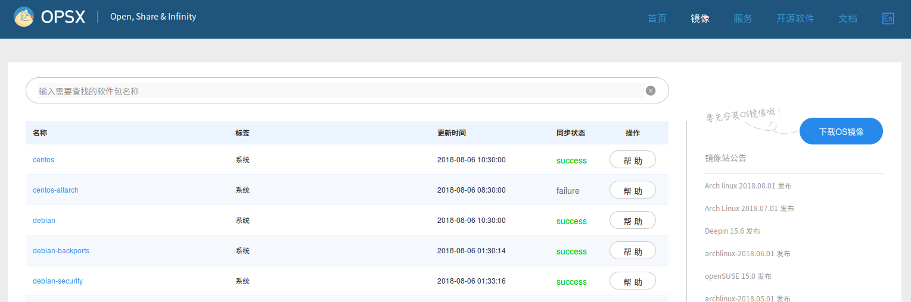
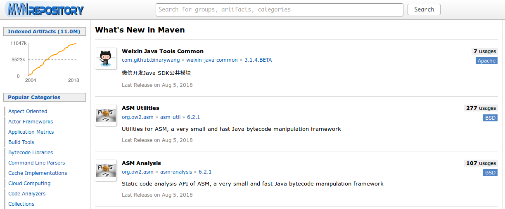
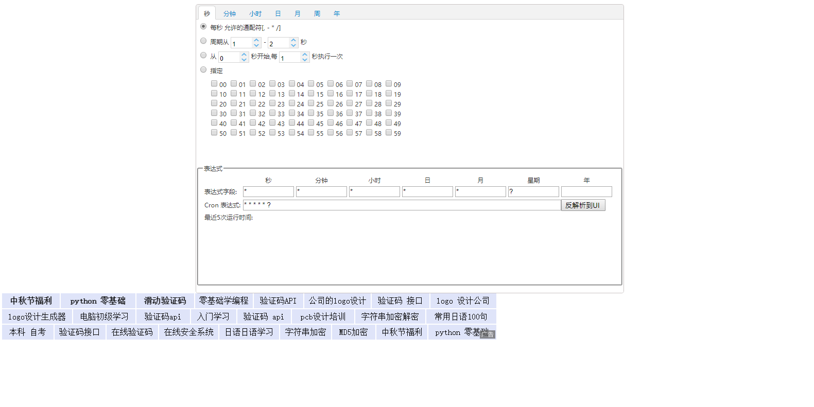

## 学习网站
>[并发编程网：并发相关资源学习](http://ifeve.com/)
>[菜鸟教程：各语言基础教程](https://www.runoob.com/)
>[外国学习网站：baeldung](https://www.baeldung.com)
## MarkDown语法
[MarkDown语法大全](https://www.jianshu.com/p/ebe52d2d468f)
## 系统镜像下载地址
>系统镜像：https://opsx.alibaba.com/mirror
>Docker镜像市场：http://hub.daocloud.io

## 电视剧视频地址
>云播TV：http://www.yunbtv.com

## Maven公共仓库
>Maven公共仓库：http://mvnrepository.com

## 在线Cron表达式生成器
>在线Cron表达式生成器：http://cron.qqe2.com

## 在线Api接口管理
>在线Api接口管理：https://apizza.net

## 在线程序员速记
>在线程序员速记：https://www.sheetgit.com/

>git 常用命令速查表
https://www.sheetgit.com/sheets/0d7ce5911254db982aa7b1601fa0fa6d 
>vim 命令速查表
https://www.sheetgit.com/sheets/9e58d539d616e9bc68b8d729957ad0dc 
>linux 运维常用命令
https://www.sheetgit.com/sheets/9f67af8c402a3368da98363e9c378f4e 
>Java常用的八种排序算法
https://www.sheetgit.com/sheets/297e6c5d8a1172ee0ff635f616f04eba 
## 算法动画演示
>算法动画演示：http://algoanim.ide.sk/index.php?page=showanim&id=63
## 生成编译器Banner特殊文字
>[生成编译器Banner特殊文字](http://patorjk.com/software/taag/#p=display&f=Graffiti&t=Qi%20Hai%20Yang%20!)
## 在线工具箱
>[在线工具箱](https://tool.lu/)
## java知识点整理
>[java知识点整理](https://snailclimb.gitee.io/javaguide)
## 思维导图
>[思维导图](https://mm.edrawsoft.cn)
## 流程图等各种图在线
>[流程图等各种图在](https://www.processon.com)

